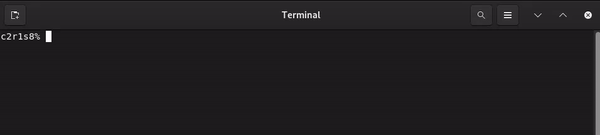

# GET_NEXT_LINE



O projeto **get_next_line** é uma implementação em C de uma função que lê uma linha de um arquivo por vez, o que é útil para processar grandes volumes de dados sem carregar o arquivo completo na memória. Esta função é uma ótima ferramenta para manipulação de dados em arquivos e é frequentemente utilizada em vários projetos de software.

## Descrição do Projeto

A função `get_next_line` lê linhas de um arquivo usando um buffer para armazenar os dados intermediários até que uma linha completa seja encontrada ou o fim do arquivo seja atingido. Várias funções auxiliares foram implementadas para facilitar o gerenciamento de strings e de buffers durante o processo de leitura.

### Funções Implementadas

- **`ft_strlen`**: Retorna o comprimento de uma string.
  
- **`ft_strjoin`**: Concatena duas strings em uma nova string alocada dinamicamente.
  
- **`ft_strchr`**: Procura um caractere específico dentro de uma string e retorna um ponteiro para ele, se encontrado.
  
- **`ft_substr`**: Extrai uma substring de uma string original, dado um índice de início e um comprimento.
  
- **`ft_strdup`**: Duplica uma string, alocando memória para a nova cópia.
  
- **`get_next_line_aux`**: Função auxiliar que lê do arquivo e acumula os dados até que uma linha completa ou o fim do arquivo seja encontrado.
  
- **`ft_exclude_line`**: Remove a linha lida do buffer para preparar o buffer para a próxima chamada de `get_next_line`.
  
- **`get_next_line`**: Função principal que retorna a próxima linha do arquivo especificado pelo descritor de arquivo `fd`. Utiliza um buffer de leitura para acumular dados até que uma linha completa esteja disponível.

## Como Usar

Para usar o `get_next_line`, inclua o arquivo de cabeçalho no seu projeto e defina o tamanho do buffer através da constante `BUFFER_SIZE`, que determina quantos bytes serão lidos a cada chamada de leitura (`read`). Abaixo está um exemplo de uso básico com um arquivo de texto:

### Exemplo de Código

```c
#include <fcntl.h>
#include <stdio.h>
#include "get_next_line.h"

int main() {
    char *path = "/path/para/seu/arquivo.txt";
    int fd = open(path, O_RDONLY);
    char *line;
    int i = 0;

    if (fd == -1) {
        perror("Erro ao abrir o arquivo");
        return (1);
    }

    while (i <= 2) {
        line = get_next_line(fd);
        if (line) {
            printf("%s\n", line);
            free(line);
        }
        i++;
    }

    close(fd);
    return (0);
}
```

**Saída Esperada**

O código acima vai imprimir as três primeiras linhas do arquivo fornecido.

## Compilação

Para compilar o get_next_line junto com um arquivo de teste, utilize o seguinte comando:

```
gcc -Wall -Wextra -Werror get_next_line.c get_next_line_utils.c main.c -o get_next_line
```

## Considerações Importantes

- **`BUFFER_SIZE`**: O tamanho do buffer de leitura pode impactar a eficiência do código. Se o BUFFER_SIZE for muito pequeno, podem ocorrer várias chamadas de read, diminuindo a performance. Um tamanho muito grande, por outro lado, pode desperdiçar memória. Ajuste conforme necessário para o seu caso de uso.

- **Recursos Alocados**: Cada linha lida precisa ser liberada (free) após o uso para evitar vazamento de memória.

- **Função Estática**: O uso de uma variável estática (backup) permite que o get_next_line retome a leitura de onde parou, mantendo o contexto do buffer entre chamadas.


